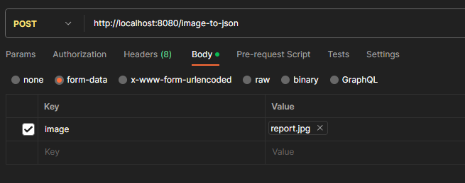
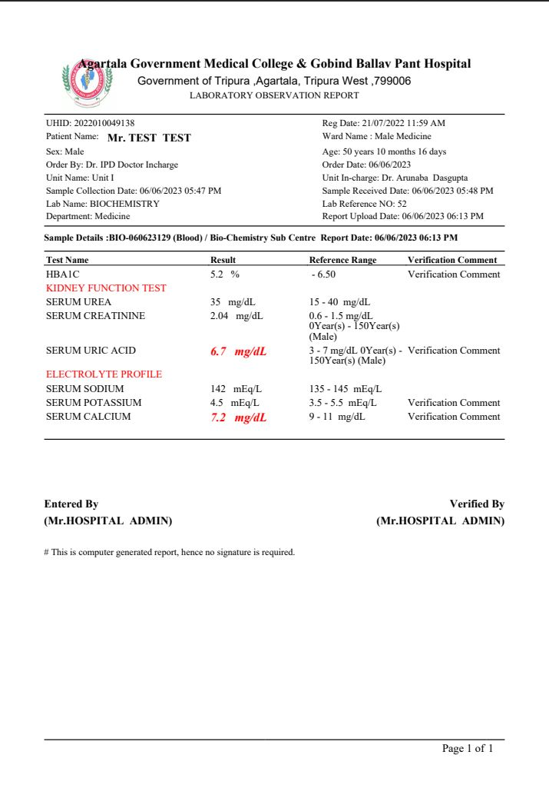

# eHospital LIS Image OCR API
The eHospital LIS Image OCR API is a web service that allows you to extract text from images and convert it into JSON or plain text formats. This API utilizes the Tesseract OCR engine to perform optical character recognition on the provided image file.

## Build and Run

To build and run the Lab Report OCR API, follow these steps:

1. Clone the repository from GitHub:
   
   `git clone https://github.com/keraskp/imageOCR.git`
   
2. Navigate to the project directory:
   
   `cd imageOCR`
   
3. Build the project using Maven:
   
   `mvn clean package`
   
4. Run the application:
   
   `java -jar target/imageOCR.jar`
   

The API will be accessible at `http://localhost:8080`.

## Usage
### Image to Json
**Endpoint:** `/image-to-json`

**Method:** POST

**Description:** Extracts text from the uploaded image file and converts it into JSON format.

**Request Parameters:**

| Parameter   |      Type      |           Description          |
|-------------|:--------------:|-------------------------------:|
|    image    |  report.jpg    | The image file to be processed |

<center>

</center>

<br>

**Sample Image:**

<center>

</center>

**Success Response:**

- *Status Code:* 200 OK
- *Content Type:* application/json
- *Body:* 

```json
{
    "": "150Year(s) (Male",
    "Age: ": "50 years 10 months 16 days",
    "Lab Reference NO: ": "52",
    "Page ": "1 of",
    "SERUM CALCIUM ": "7.2 mg/dL 9-11 mgidL Verification Comment",
    "Sample Collection Date: ": "06/06:2023 05:47 PM",
    "SERUM POTASSIUM ": "45 mEqL 35-55mEQL  Verification Comment",
    "HBAL ": "52 % -650 Verification Comment",
    "Unit Name: Uit ": "1",
    "SERUM SODIUM ": "142 mEQL 135- 145 mEqL",
    "UHID: ": "2022010049138",
    "SERUM UREA ": "35 mg/dL 15-40 mg/dL",
    "SERUM CREATININE ": "204 mgldL 06- 1.5 mg/dL",
    "SERUM URIC ACID ": "6.7 mglL o mg/dL 0Year(s) - Verification Comment",
    "Government of Tripura Agartala, Tripura West ": "799006",
    "Report Upload Date: ": "06/062023 06:13 PM",
    "‘Sample Received Date: ": "06/06/2023 05:48 PM",
    "Order Date: ": "06/062023",
    "Oear - ": "50Yeat",
    "Reg Date: ": "210772022 1159 AM"
}
```


**Failure Response:**

1. No file provided
- *Status Code:* 400 Bad Request
- *Body:* `Image File is Required`

2. Non-image file provided
- *Status Code:* 400 Bad Request
- *Body:* `Error! provide proper image file`

3. Issue with image to text conversion
- *Status Code:* 500 Internal Server Error
- *Body:* `Error extracting text from image`


### Image to Text
**Endpoint:** `/image-to-text`

**Method:** POST

**Description:** Extracts text from the uploaded image file in plain text format.

Request Parameters:
| Parameter   |      Type      |           Description          |
|-------------|:--------------:|-------------------------------:|
|    image    |  report.jpg    | The image file to be processed |

**Success Response:**

- *Status Code:* 200 OK
- *Content Type:* application/json
- *Body:* 

```text
g;la Government Medical College & Gobind Ballay Pant Hospital
Government of Tripura Agartala, Tripura West 799006
LABORATORY OBSERVATION REPORT

UHID: 2022010049138
Patient Name: Mr. TEST TEST
Sex: Male

Order By: Dr. IPD Doctor Incharge.
Unit Name: Uit 1

Sample Collection Date: 06/06:2023 05:47 PM

Lab Name: BIOCHEMISTRY
Department: Medicine

Reg Date: 210772022 1159 AM
‘Ward Name : Male Medicine

Age: 50 years 10 months 16 days

Order Date: 06/062023

Unit In-charge: Dr. Arunsba Dasgupta
‘Sample Received Date: 06/06/2023 05:48 PM
Lab Reference NO: 52

Report Upload Date: 06/062023 06:13 PM

Bio-Cheistry Sub Centre ™
Test Name Result ification Comment
HBAL 52 % -650 Verification Comment
KIDNEY FUNCTION TEST
SERUM UREA 35 mg/dL 15-40 mg/dL
SERUM CREATININE 204 mgldL 06- 1.5 mg/dL.
Oear - 50Yeat)
SERUM URIC ACID 6.7 mglL o mg/dL 0Year(s) - Verification Comment
150Year(s) (Male)
ELECTROLYTE PROFILE
SERUM SODIUM 142 mEQL 135- 145 mEqL
SERUM POTASSIUM 45 mEqL 35-55mEQL  Verification Comment
SERUM CALCIUM 7.2 mg/dL 9-11 mgidL Verification Comment
Entered By Verified By
(Mr-HOSPITAL ADMIN) (Mr-HOSPITAL ADMIN)

#Thi

Page 1 of |

```


**Failure Response:**

1. No file provided
- *Status Code:* 400 Bad Request
- *Body:* `Image File is Required`

2. Non-image file provided
- *Status Code:* 400 Bad Request
- *Body:* `Error! provide proper image file`

3. Issue with image to text conversion
- *Status Code:* 500 Internal Server Error
- *Body:* `Error extracting text from image`


## Libraries and Tools Used

The following libraries and tools are used in this API:
- Language :  Java (JDK 17) 
- Framework:  SpringBoot (3.0.8) 

## Dependencies
Maven Dependencies used:
- tess4j: The library provides optical character recognition (OCR) support for: TIFF, JPEG, GIF, PNG, and BM(provided in this project)
- org.json: JSON is a light-weight, language independent, data interchange format
- spring-boot-starter-web: Starter for building web, including RESTful, applications using Spring MVC. Uses Tomcat as the default embedded container


## License
This API is open source and licensed under the MIT License.


## Contributions
Contributions to this project are welcome. If you encounter any issues or have suggestions for improvements, please open an issue or submit a pull request on the project's repository or mail me at suggi.aditya@gmail.com

